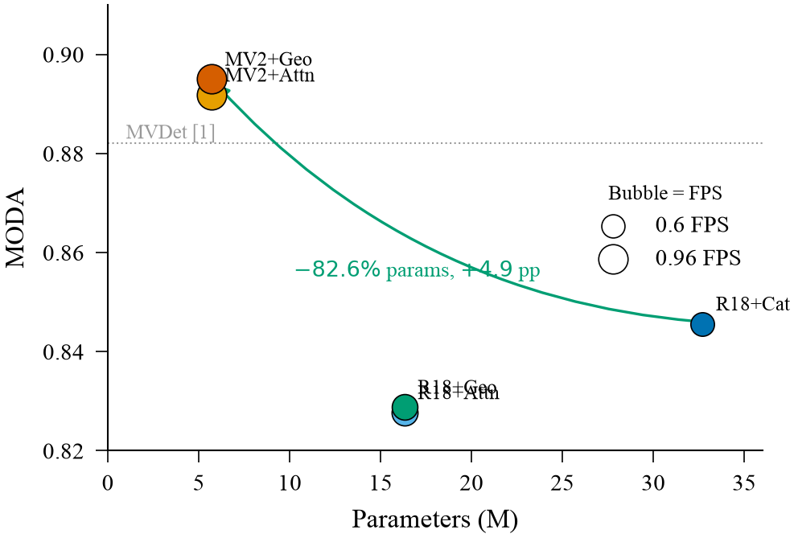
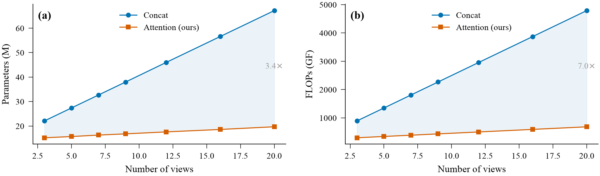
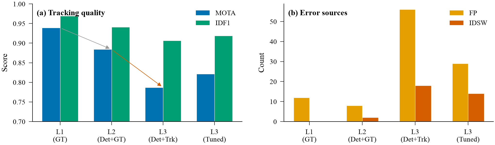
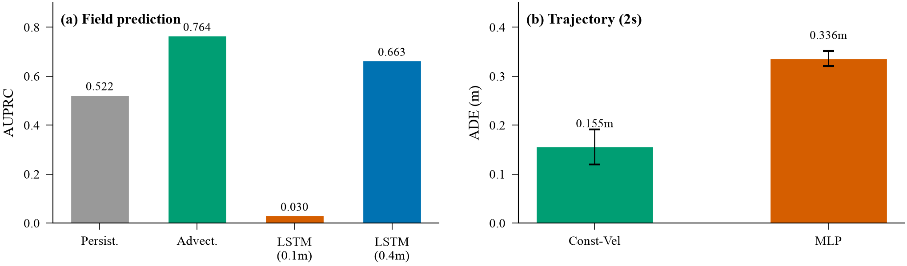
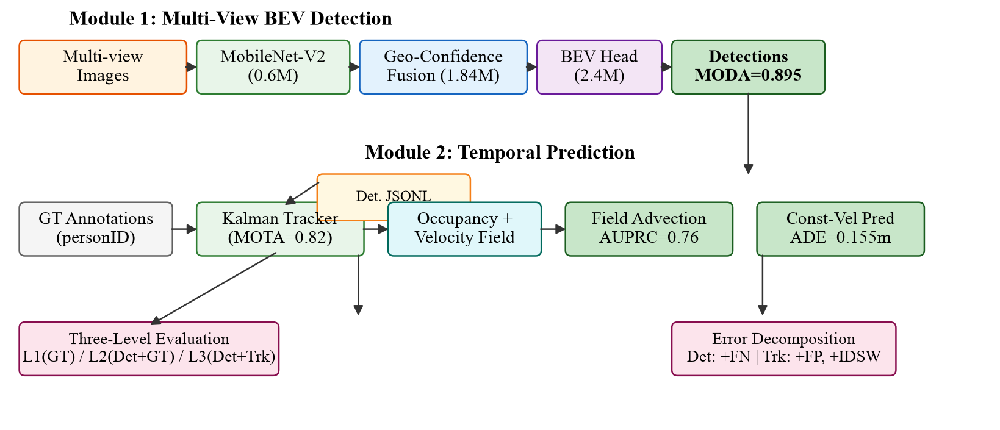
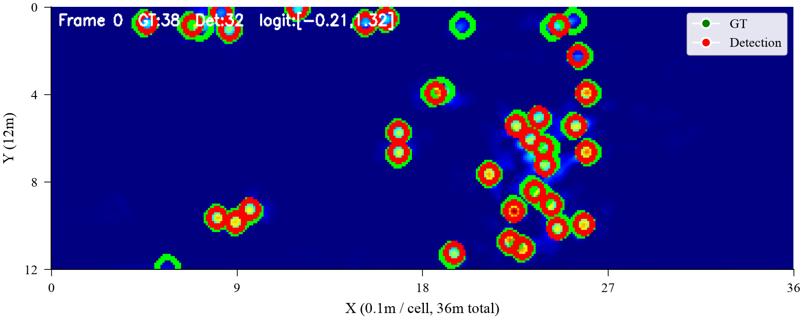
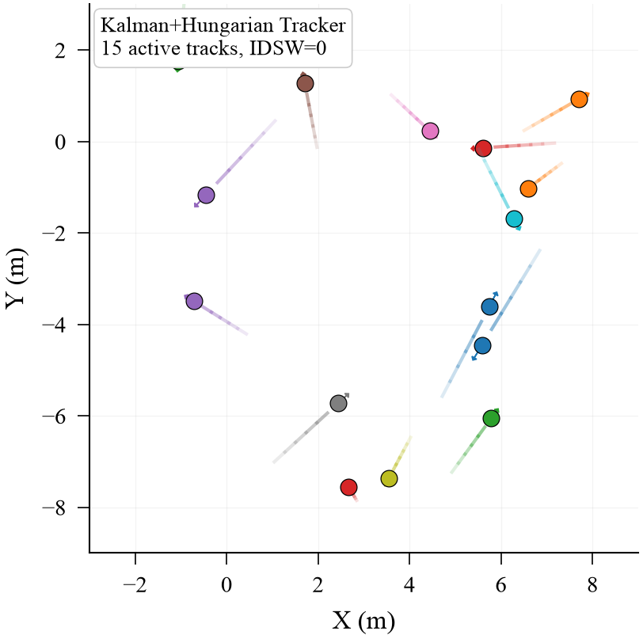

# Result Figures

> Generated by `scripts/generate_paper_figures.py` (CVPR/ECCV style)

## Module 1: Detection

| # | Figure | Description |
|---|--------|-------------|
| 1 |  | Training convergence (BEV loss, 5 configs) |
| 2 |  | MODA / Precision / Recall comparison |
| 3 |  | Parameter-accuracy Pareto (bubble = FPS) |
| 4 |  | Scalability: params & FLOPs vs views |

## Module 2: Temporal Prediction

| # | Figure | Description |
|---|--------|-------------|
| 5 |  | Three-level evaluation (MOTA/IDF1 + FP/IDSW) |
| 6 |  | Field prediction AUPRC + trajectory ADE |
| 7 |  | System architecture diagram |
| 8 |  | BEV detection result (real output) |
| 9 |  | BEV tracking visualization |

## Regeneration

```bash
python3 scripts/generate_paper_figures.py
```
