# Result Figures

> Generated by `scripts/generate_figures.py` on 2026-07-30

## Module 1: BEV Detection

| Figure | Description |
|--------|-------------|
| 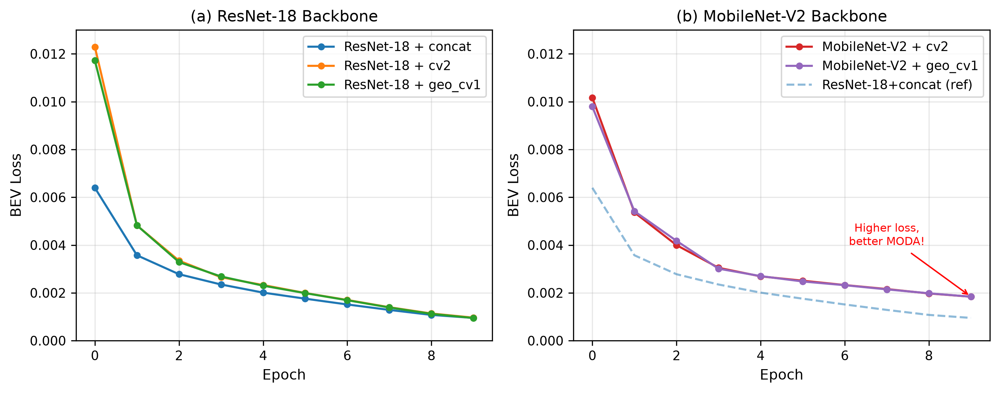 | **Fig 1.** Training loss curves — MobileNet-V2 has higher loss but better generalization |
| 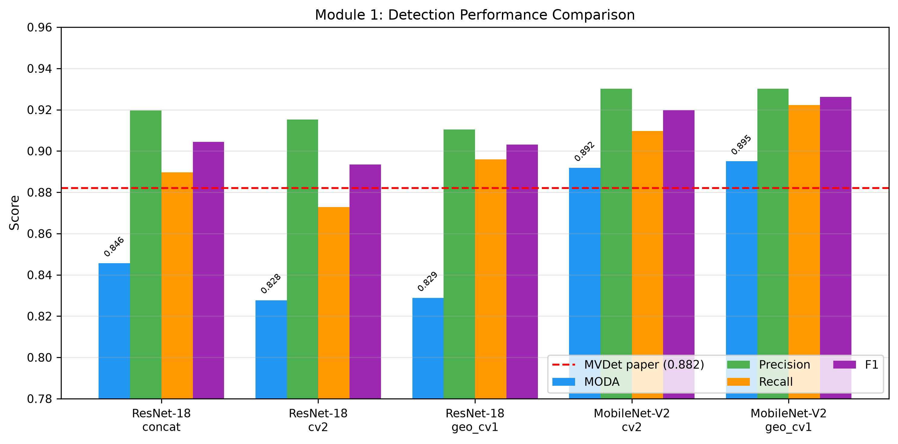 | **Fig 2.** Detection metrics comparison — all 5 valid configs vs MVDet paper baseline |
| 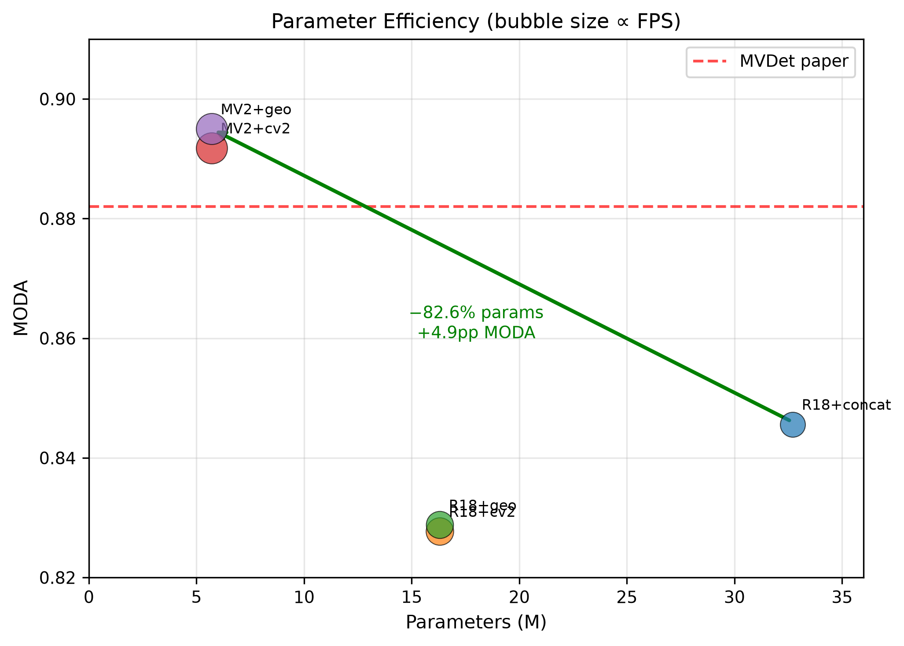 | **Fig 3.** Parameter efficiency — MODA vs params (bubble=FPS) |
| 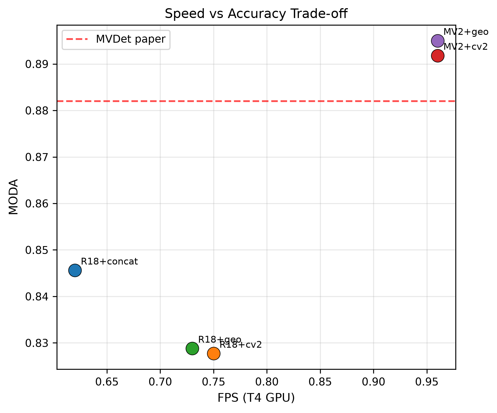 | **Fig 4.** Speed-accuracy tradeoff |
| 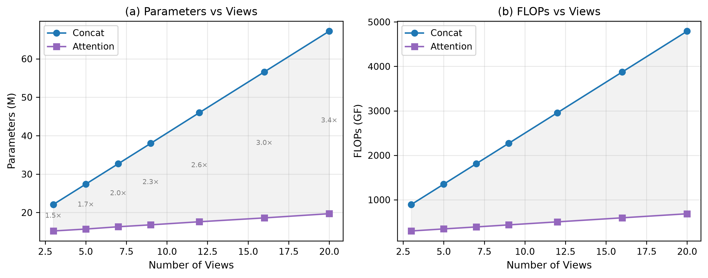 | **Fig 5.** Scalability — concat grows linearly, attention stays flat |
| 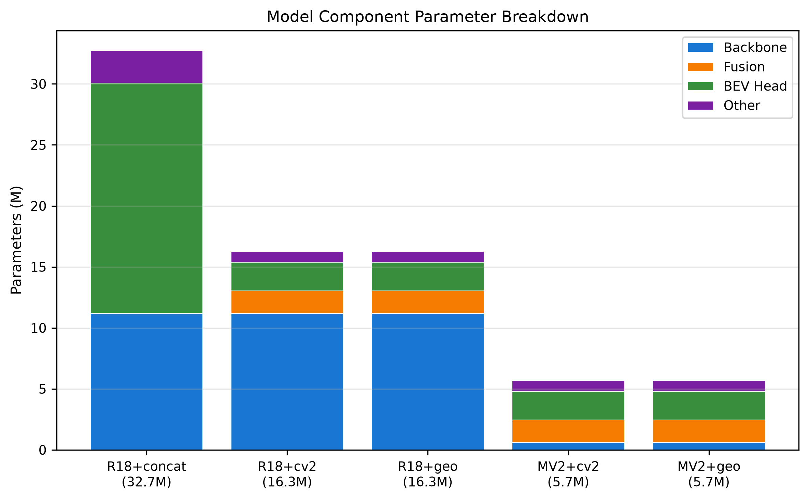 | **Fig 6.** Parameter breakdown by component |

## Module 2: Temporal Prediction

| Figure | Description |
|--------|-------------|
| 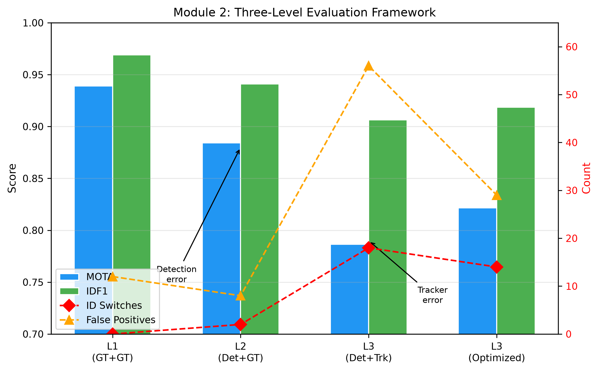 | **Fig 7.** Three-level evaluation (L1/L2/L3) with error decomposition |
| 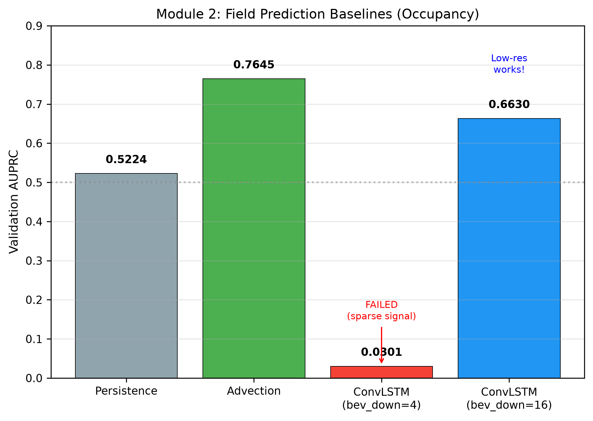 | **Fig 8.** Field prediction baselines — Advection strongest, ConvLSTM resolution-dependent |
| 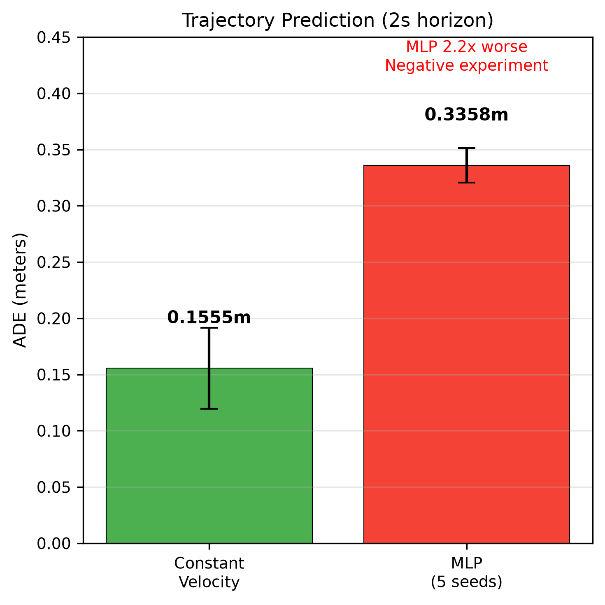 | **Fig 9.** Trajectory prediction — MLP fails to beat constant velocity |
| 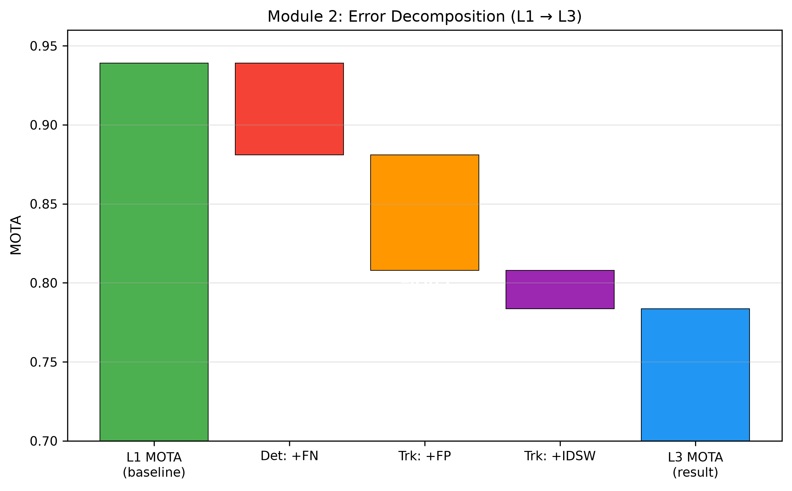 | **Fig 10.** Error decomposition waterfall (L1→L3 MOTA degradation) |
| 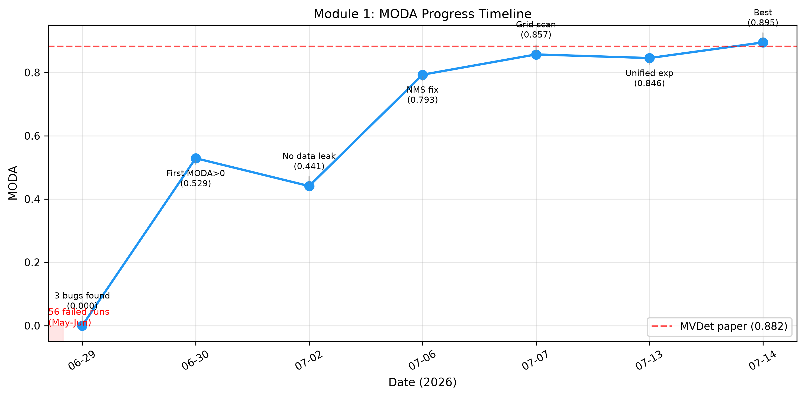 | **Fig 11.** Project MODA progress timeline |
| 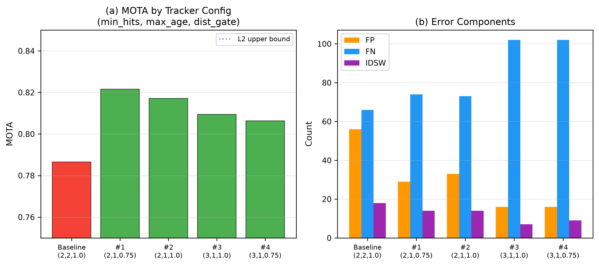 | **Fig 12.** Tracker parameter grid search results |

## Regeneration

```bash
cd BEV_Track-Predict
python3 scripts/generate_figures.py
```
